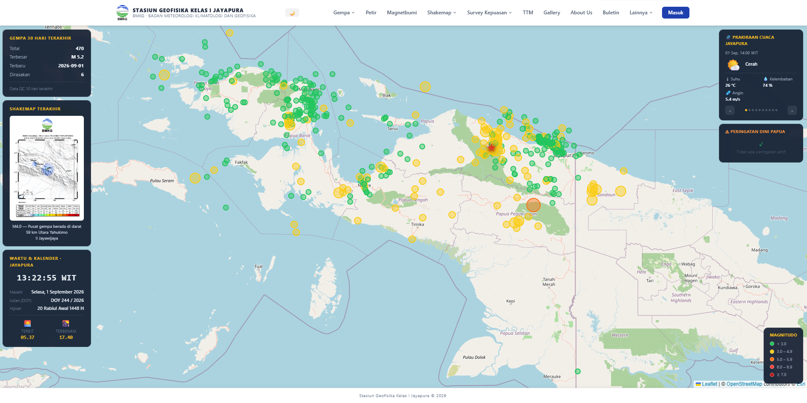
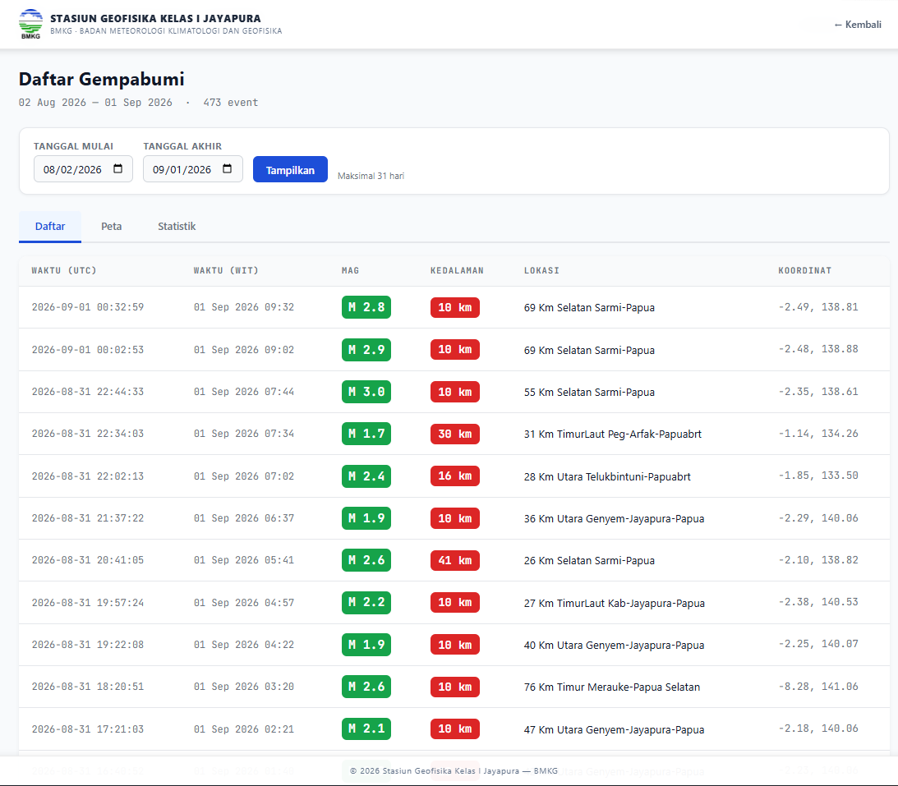
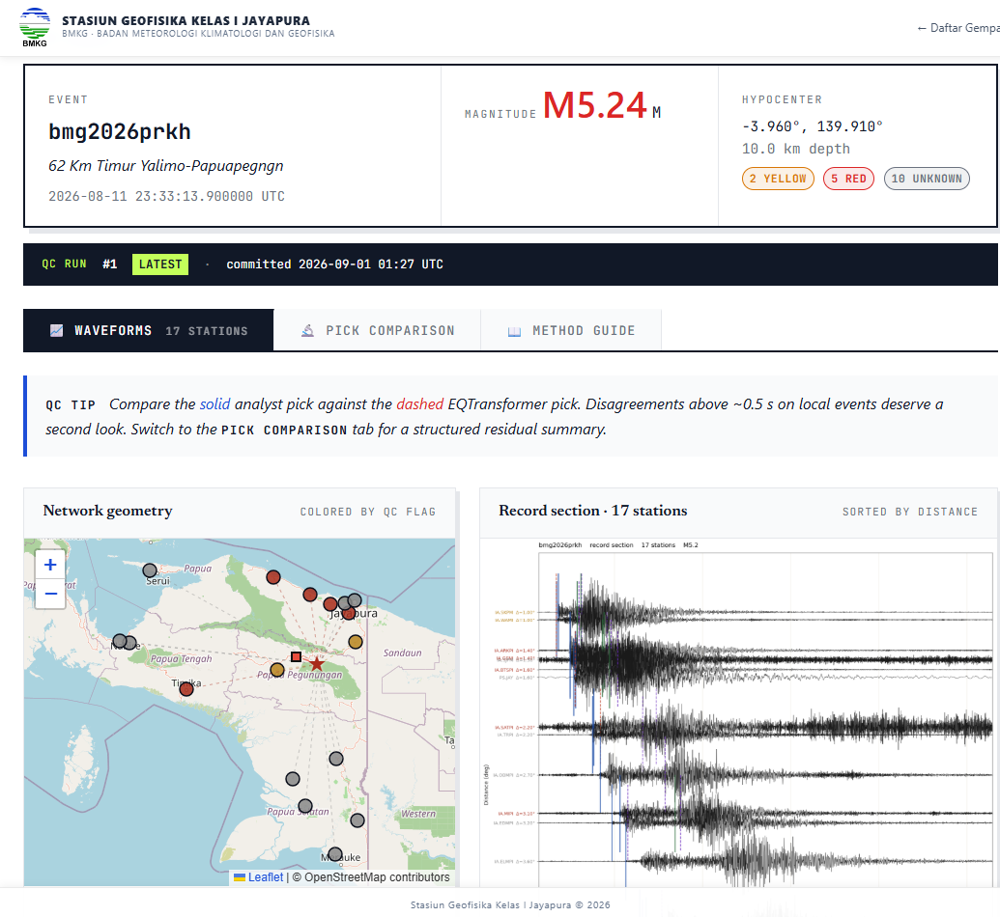
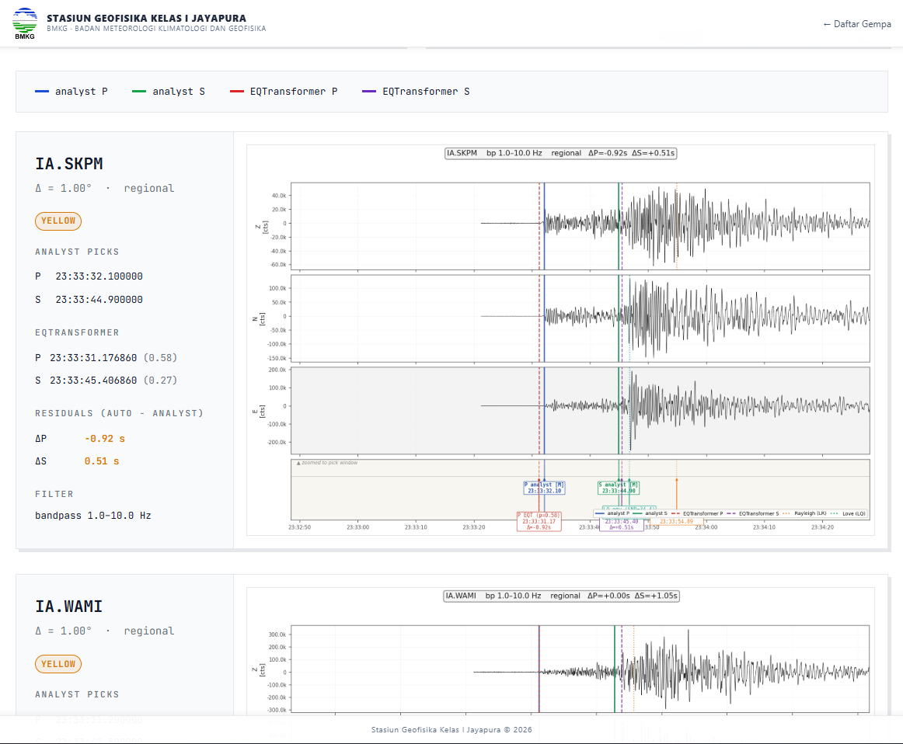
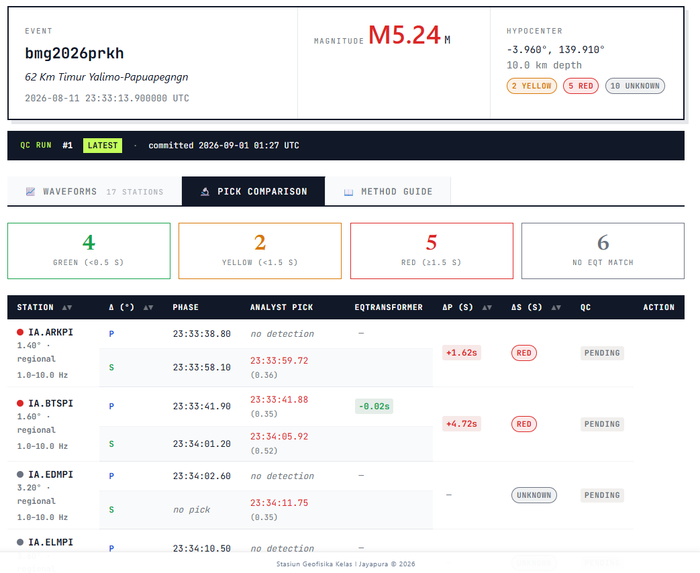

# new-datin

**Sistem Informasi Geofisika — Stasiun Geofisika Kelas I Jayapura BMKG**

`new-datin` is a Django-based web application that serves as the operational
information system for the BMKG Geophysical Station Class I Jayapura. It
presents earthquake and ShakeMap products, geomagnetic and lightning data,
early-warning information, and a collection of internal operational tools —
from inventory management to operator logbooks — in one integrated platform.

The project powers the public website at `36.91.166.189` and also provides the
REST API endpoints used by the station's automated pipelines (SeisComP QC
worker, ShakeMap generator, WRSNG devices, and instrument status monitors).

## Table of contents

- [Main modules](#main-modules)
- [Screenshots](#screenshots)
- [Tech stack](#tech-stack)
- [External integrations](#external-integrations)
- [Project structure](#project-structure)
- [API endpoints](#api-endpoints)
- [Local development setup](#local-development-setup)
- [Production deployment](#production-deployment)

## Main modules

| App | Purpose |
|---|---|
| `theme` | Public landing page, dashboard, custom login/OTP, base templates |
| `repository` | Earthquake events, ShakeMap gallery, felt earthquakes, EventBrowser, data availability, JSON analysis, bulletin & siaran pers |
| `monitor` | Public earthquake list and station map |
| `qc_review` | SeisComP waveform QC review — analyst vs auto picks, run history |
| `magnet` | Geomagnetic (magnetbumi) data and instrument status |
| `lightning` | Lightning (petir) grid pipeline and dashboard |
| `hujan` | Rainfall observations |
| `almanac` | Almanac data |
| `wrsng` | WRSNG device status |
| `stations` | Station metadata and SeedLink fetching |
| `logbook` | Operator logbook (ESDX, LEMI, etc.) |
| `jadwal` | Shift/jadwal management |
| `maintenance` | Instrument maintenance tracking |
| `perjadin` | Official travel (perjalanan dinas) management |
| `arsip` | Document archive |
| `layanan` | Public services (layanan publik) |
| `guests` | Guest book (buku tamu) |
| `pengaduan` | Public complaints |
| `monitoring_pm` | Inventory monitoring: peralatan, suku cadang, peminjaman |

## Screenshots

### Landing page



### Daftar gempa (earthquake list)



### Event detail







## Tech stack

- **Python 3.12** / **Django 5.2**
- **PostgreSQL + PostGIS** for spatial data
- **Redis** as Celery broker/result backend and cache
- **Celery + Celery Beat** for scheduled jobs (shakemap processing, grid pipeline, etc.)
- **Django REST Framework** for API endpoints
- **Tailwind CSS** for UI
- **django-otp** for TOTP multi-factor authentication
- **ObsPy** (worker side) and **Matplotlib** for waveform/spectra rendering

## External integrations

- **SeisComP QC worker** — posts analyst/auto pick comparisons to `/qc/api/qc-events/`
- **ShakeMap generator** — pushes `.psa5`, waveform PNGs, and `.mseed` files via rsync and HTTP API
- **WRSNG** — devices post status updates to `/api/wrsng/status/update/`
- **SeedLink** — seismic/accelerometer station availability from SeisComP
- **BMKG CDN** — felt-earthquake and ShakeMap image fetching
- **YOLO training dashboard** — private progress/snapshot push endpoints

## Project structure

```
new-datin/
├── datin_project/          # Django project settings, Celery, URLs, WSGI/ASGI
├── theme/                  # Landing page, dashboard, auth, base templates
├── repository/             # Earthquakes, ShakeMap, EventBrowser, bulletins
├── monitor/                # Public event list, station map
├── qc_review/              # Waveform QC review
├── magnet/                 # Geomagnetic data
├── lightning/              # Lightning pipeline
├── hujan/                  # Rainfall
├── almanac/                # Almanac
├── wrsng/                  # WRSNG status
├── stations/               # Station metadata / SeedLink
├── logbook/                # Operator logbook
├── jadwal/                 # Scheduling
├── maintenance/            # Instrument maintenance
├── perjadin/               # Official travel
├── arsip/                  # Archive
├── layanan/                # Public services
├── guests/                 # Guest book
├── pengaduan/              # Complaints
├── monitoring_pm/          # Inventory monitoring
├── scripts/                # Deployment, sync, and monitoring scripts
└── docs/images/            # Screenshots used in this README
```

## API endpoints

| Endpoint | Description |
|---|---|
| `/api/shakemap/psa5/` | PSA5 spectrum upload from the ShakeMap machine |
| `/api/shakemap/waveform/` | MiniSEED waveform upload (renders PNG) |
| `/api/shakemap/<event_id>/spectrum.json` | Response-spectrum data per event |
| `/api/shakemap/<event_id>/mseed-zip/` | Download all MiniSEED files for an event |
| `/qc/api/qc-events/` | SeisComP QC event ingest |
| `/api/wrsng/status/update/` | WRSNG status updates |
| `/api/events/push/` | EventBrowser push |
| `/api/availability/report/` | Data availability report |
| `/api/yolo/state/` | YOLO training state |

## Local development setup

1. Create a virtual environment and install dependencies:

   ```bash
   python3 -m venv .venv
   source .venv/bin/activate
   pip install -r requirements.txt
   ```

2. Configure environment variables:

   ```bash
   cp .env.example .env.local   # or create .env.local manually
   ```

   The main settings are `SECRET_KEY`, `DEBUG`, `ALLOWED_HOSTS`,
   `DB_NAME`/`DB_USER`/`DB_PASSWORD`/`DB_HOST`/`DB_PORT`, and Redis URLs.

3. Prepare PostgreSQL + PostGIS and Redis:

   ```bash
   sudo -u postgres createdb datin
   sudo -u postgres psql -d datin -c "CREATE EXTENSION postgis;"
   ```

4. Run migrations and start the server:

   ```bash
   python manage.py migrate
   python manage.py runserver
   ```

5. Celery (optional, for scheduled pipelines):

   ```bash
   celery -A datin_project worker -l info
   celery -A datin_project beat -l info
   ```

## Production deployment

Production runs from `/var/www/html` behind nginx. To deploy:

```bash
cd /var/www/html
bash scripts/deploy.sh
```

The deploy script pulls the latest `main` from GitHub, installs dependencies,
runs migrations and `collectstatic`, then restarts the `datin`,
`datin-celery`, and `datin-celery-beat` systemd services.

> **Note:** production uses HTTPS with a self-signed certificate. API senders
> must trust `scripts/shakemap/prod-ca.pem` (see the `scripts/shakemap/`
> send scripts for examples).
